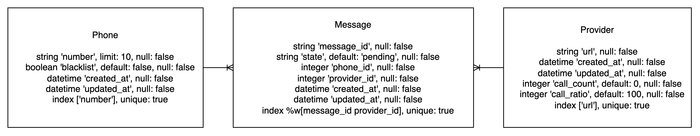
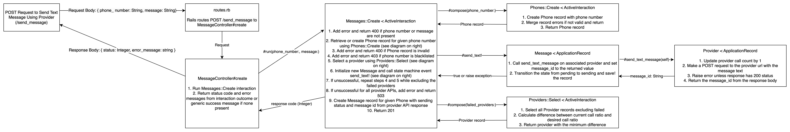
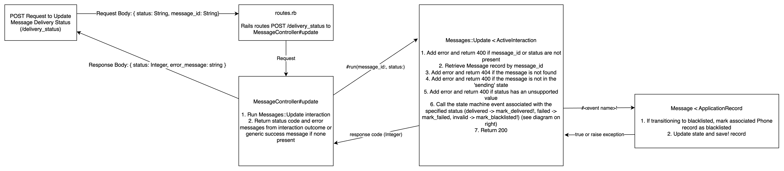

# README

## Summary
This application consists of three API endpoints:
- A POST endpoint for sending messages (/send_message)
- A POST endpoint for updating the status of in-progress messages (/delivery_status)
- A GET endpoint which displays all message details in HTML format by default and allows searching by phone number (/list_messages)

## Prerequisites
* Ruby 3.2.2
* Git
* Bundler version 2.4.10
* [ngrok](https://ngrok.com/docs/getting-started/)

## Setup
```bash
git clone https://github.com/pirelliandrew/messaging_app.git
cd apple_demo
bundle install
bundle exec rails db:setup
```

## Running the application
```bash
# In first terminal
bundle exec rails s
# In second terminal
TODO: ngrok command
```

Application is accessible at http://localhost:3000/.

## Tests
My preferred testing strategy is Behavior-Driven Development (BDD). If you have an hour to spare, I would strongly recommend watching [this Youtube video by Ian Cooper](https://www.youtube.com/watch?v=vOO3hulIcsY&ab_channel=NDCConferences) to get familiar with BDD. If you have 20 hours to spare, I would recommend reading [Test Driven Development by Kent Beck](https://www.amazon.com/Test-Driven-Development-Kent-Beck/dp/0321146530) to get very familiar with BDD.

As per BDD, all tests were written at the system level, in this case the API layer, in order to validate that the feature behave as intended and will continue to behave as intended should the codebase change in the future.

The only exception is that I also added tests for the model validations as it can prove impractical to test all data validations from the API layer over time and data integrity is critical.

Generally I would prefer to use fixturing framework such as [factory_bot](https://github.com/thoughtbot/factory_bot_rails) for simple and consistent creation of database records in test environments, but have not added it to this project yet in order to save time.

The test suite can be ran using the following command:
```bash
bundle exec rspec
```

For detailed documentation on the behavior of the API, use:
```bash
bundle exec rspec --format documentation
```

## API Examples
### POST /send_message
#### Sample Request:
```bash
POST /dev/provider1 HTTP/2
Content-Type: application/json
{
  "phone_number": "1234567890",
  "message": "This is a sample message"
}
```

#### Sample curl command
```bash
curl -X POST -H "Content-Type: application/json" -d '{"phone_number":
"1234567890", "message": "This is a sample message"}'
"http://localhost:3000/send_message"
```

#### Sample Response:
```bash
HTTP/2 201
Content-Type: application/json
{
  "message" : "Message successfully created"
}
```

### POST /delivery_status
#### Request:
```bash
POST /dev/provider1 HTTP/2
Content-Type: application/json
{
  "status": "delivered",
  "message_id": "19ee63f9-4447-4a8b-9981-a9cf9b631a16"
}
```

#### Sample curl command
```bash
curl -X POST -H "Content-Type: application/json" -d '{"status":
"delivered", "message_id": "19ee63f9-4447-4a8b-9981-a9cf9b631a16"}'
"http://localhost:3000/delivery_status"
```

#### Response:
```bash
HTTP/2 200
Content-Type: application/json
{
  "message" : "Message successfully updated"
}
```

### GET /list_messages
#### Request:
Visit http://localhost:3000/list_messages in your browser.

#### Response:
TODO: Image

## Client Library Examples
Due to encapsulating all the business logic inside [Active Interactions](https://github.com/AaronLasseigne/active_interaction), all the APIs can be triggered from the Rails console, acting as a pseudo client library when running the application locally.

The Rails console can be started using:
```bash
bundle exec rails c
```

### Sending a message (equivalent to POST /send_message):
```ruby

```

### Updating the status of a message (equivalent to POST /delivery_status):
```ruby

```

### Listing message details by phone number (equivalent to GET /list_messages):
```ruby

```

### Error handling
By using `run!`, exceptions with descriptive error messages will automatically be raised for invalid inputs:
```ruby

```

## Design
### Data Models
The database schema can be visualized as per the following diagram:


#### Message
A message record represents a successful API call from this application to one of the specified providers.

It must belong to one phone record and one provider record.

This felt like an appropriate abstraction for the current scope of this application since message creation and calls to API providers are currently all performed synchronously.

message_id uniqueness is only enforced on a per provider basis as providers will likely be completely agnostic of the message ids generated by other providers in practice.

The text of messages is not stored in the database as it is sensitive user data. In practice, it may be best to generate an idempotency key based on an obfuscated version of the message text and phone number in order to avoid duplicate text messages being sent to the same phone number within in a short period of time.

The state is used by a [state machine](https://github.com/aasm/aasm) in the Message model which allows the following state transitions:
1. pending -> sending
2. sending -> delivered
3. sending -> failed
4. sending -> blacklisted

Note: In order to avoid namespace collisions with the state machine helper functions and active record such as `invalid?`, callbacks from providers with the status `invalid` are reflected as `blacklisted` due to the fact that they represent that the phone number should be blacklisted.

Relevant business logic is tied to the transitions though this only applied in a few cases for this application. For example, when transitioning a message record from pending to sending, it first tries sending a text message for that message through the next provider selected by the load balancing algorithm. This business logic can be skipped by directly updating the state of the record instead of calling the state machine event for the transition.

#### Phone
A phone record represents a phone number which has been used for a request to the POST /send_message endpoint.

It has many message records.

A phone message can be marked as blacklisted via the `blacklist` column, which will cause all future requests to POST /send_message with that phone number to be rejected with a 403 response.

#### Provider
A provider represents a URL which can be called to send a text message.

It has many message records.

Every request made to a provider's URL, successful or not, increments its `call_count` by 1. This count is used to determine which provider should be chosen for the next request to send a text message.

Each provider can have a desired call ratio between 0 and 100. Note that there is currently no database validation which enforces that the sum of all provider call ratios equal to 100. The logic to determine the desired call ratio is `call_ratio / sum(&:call_ratio)`.

The provider which is the furthest below their desired call ratio is selected for the next request to send a text message.

### POST /send_message


At scale it would be better for this API to only create a message record in the 'pending' state and have an asynchronous processor handle the rest of the flow. This would add significant complexity as message text would have to be temporarily stored securely, however requests to this endpoint would not have to wait for the provider API calls to resolve synchronously. In this case, a message record would represent an request to this endpoint which passes validations (phone number and message are present, phone number is not blacklisted).

Load balancing based on response times would then no longer be necessary as the provider API calls would be performed asynchronously so the end user of the API would not notice any slowness. In this case it would likely make the most sense to choose whichever provider is the cheapest and have logic to automatically failover to another provider if there is an outage.

This current implementation uses 30/70 load balancing for two providers by default, though it can support more providers with custom ratios as specified above.

### POST /delivery_status


The current implementation for this endpoint currently has one bug which may become an issue at scale. Multiple message records can have the same message_id so long as they have different providers. However, if a provider sends a callback, the first record with that message_id is selected and attempted to be updated. This can lead to the incorrect record being updated. In practice, it may make more sense to get the hostname from the request headers and only query messages associated with the provider that is associated with that hostname for the given message_id.

Other than this, the current implementation satisfies the requirements as specified.

### GET /list_messages
 
